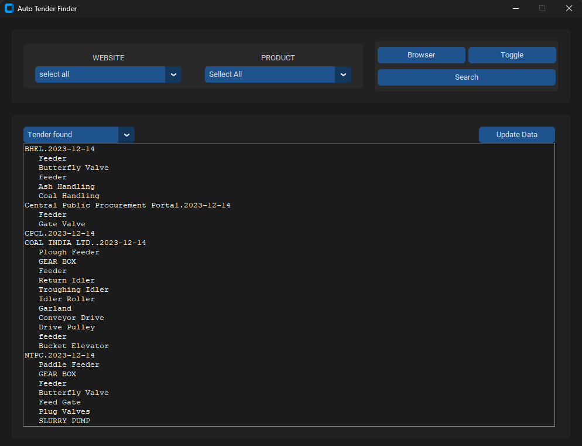
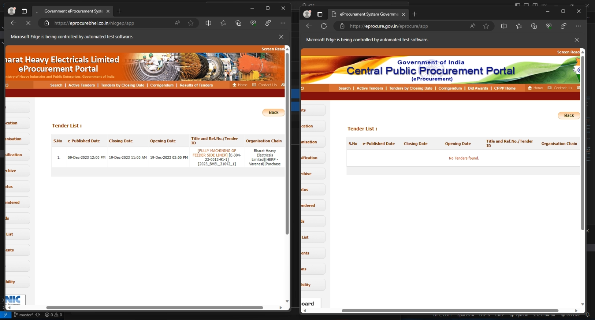
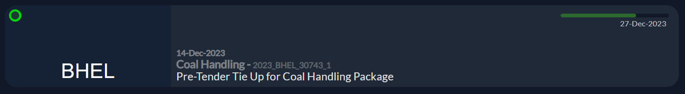

<h1>ATF & Tender Hunt</h1>

ATF & Tender Hunt aim to simplify tenders searching on the web. It scans various government and private websites, such as Coal India, GEM, Haryana, Madhya Pradesh, etc., using specified keywords or product names. The goal is to minimize workload by automating the search process across different websites and categorizing the results.

For Live Demo <a href='https://angrygamer04.github.io/Tender-Hunt/website/TenderHunt.html'>Click Here</a>

<h2>ATF - Auto Tender Finder</h2>

ATF serves as the project's backbone. While not detailed in this repository for simplicity, ATF searches 12 designated websites (more can be added), extracts keywords from a file, conducts searches, and generates a JSON file for each website.

ATF is easy to use, simply choose the website you want to search on, select the desired keyword or product name, and click on search.If you click on the browser button, you can view Tender Hunt using a local host. This means that accessing Tender Hunt is facilitated through a local server on your machine, providing a seamless browsing experience without the need for an internet connection. 

By leveraging the threading feature in Python, the search time has been significantly reduced. Now, you can simultaneously search for one keyword on two or more websites at once. This enhancement improves efficiency and accelerates the overall search process.    

<h2>Tender Hunt</h2>

Tender Hunt is the project's front end, presenting results in a user-friendly manner. Users can search for tenders on a specific day or view the latest ones. Given the daily influx of numerous tenders, it provides options to view all today's tenders or the last three days' tenders. Notably, it supports blacklisting, enables one-click document downloads, and or various websites and see tender ditel there. The aim is to enhance the ease of tender searching.

